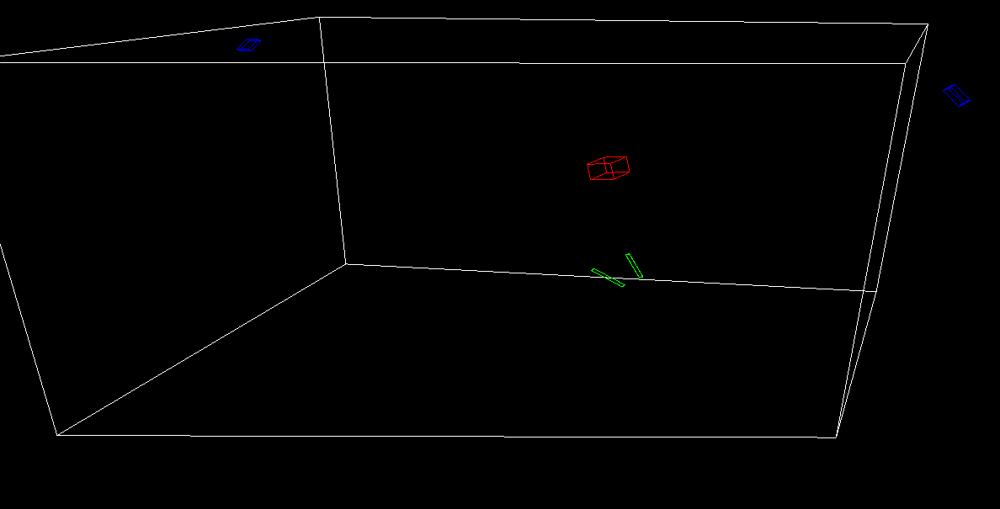

# vive-dump
Volatility Plugin to extract VR device information.
Searches memory for the chaperone configuration file. Converts and dumps the file chaperone_vis.obj

### Usage
Example `python .\vol.py --plugin vive-dump -f dump.dmp --profile Win10x64_16299 vivedump -N 5`
* -C --CHAP-FILE Provide Chaperone config file to visualizer (if not found in memory)
* -F --FULL-SCAN Scan the entire dump file, default only scans vrmonitor.exe
* -N --NUM_DEVICES To specify the number of tracked devices to extract
* -V --NO-VIS Turn of Visualization

* left/right arrows: move camera along x axis
* up/down arrows: move camera along y axis
* quote / forward slash: move camera along z axis

* Red = HMD
* Green = Controllers
* Blue = Base Stations

### Dependancies:
* Yara, make sure you download from the developer site and not pip [here](http://yara.readthedocs.io/en/v3.7.0/gettingstarted.html)
* json `python -m pip install json`
* pygame `python -m pip install pygame`
* opengl `python -m pip install PyOpenGL PyOpenGL_accelerate`
* Need the latest release of volatility. Use the profile `Win10x64_16299`

### TODOs:
* Need to be able to detect Steam VR Version, so we know which Yara rules and offsets to use
* Find other information about the controllers, eg. Serial #, Firmware, that kind of stuff

### References:
[Link to convert to quaternion](https://www.codeproject.com/Articles/1171122/WebControls/)

[How to traverse the Vad with yara](http://tomchop.me/2016/11/21/tutorial-volatility-plugins-malware-analysis/)

[Filescan](https://github.com/volatilityfoundation/community/blob/58d36880ae35e4de00d80694d54c4cae278b21c7/ThomasChopitea/autoruns.py)

[Code for Yara scan](https://github.com/volatilityfoundation/community/blob/58d36880ae35e4de00d80694d54c4cae278b21c7/KudelskiSecurity/dyrescan.py)

[Template](https://gist.github.com/bridgeythegeek/bf7284d4469b60b8b9b3c4bfd03d051e)
